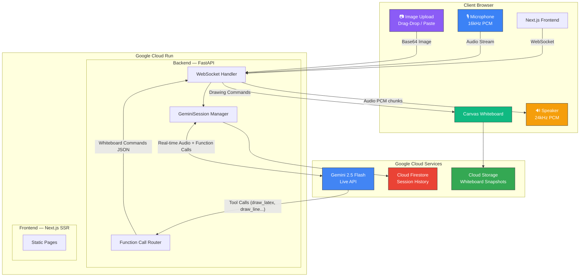

# Architecture Diagram

Paste this into https://mermaid.live to generate the PNG/SVG for submission:

## Data Flow

1. **Student speaks** → Mic captures 16kHz PCM → WebSocket → Backend → Gemini Live API
2. **Gemini responds** → Audio (24kHz) streams back → Backend → WebSocket → Browser speaker
3. **Gemini draws** → Function calls (`draw_latex`, `draw_line`, etc.) → Backend routes → WebSocket → Canvas renders
4. **Student uploads image** → Base64 → WebSocket → Backend → Gemini vision analyzes → Draws solution
5. **Student interrupts** → Text or voice → Gemini handles barge-in → Adjusts approach

## Whiteboard Tool Functions

| Function | Purpose |
|----------|---------|
| `clear_whiteboard` | Clear canvas for new problem |
| `step_marker` | Label solution steps (Step 1, 2, 3...) |
| `draw_text` | Plain text annotations |
| `draw_latex` | Mathematical expressions |
| `draw_line` | Straight lines |
| `draw_arrow` | Arrows for flow/direction |
| `draw_circle` | Circles for geometry |
| `draw_rect` | Rectangles |
| `highlight` | Semi-transparent highlight area |
