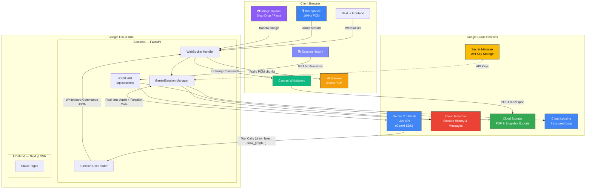

# Architecture Diagram

Paste this into https://mermaid.live to generate the PNG/SVG for submission:

## Data Flow

1. **Student speaks** → Mic captures 16kHz PCM → WebSocket → Backend → Gemini Live API
2. **Gemini responds** → Audio (24kHz) streams back → Backend → WebSocket → Browser speaker
3. **Gemini draws** → Function calls (`draw_latex`, `draw_graph`, etc.) → Backend routes → WebSocket → Canvas renders
4. **Student uploads image** → Base64 → WebSocket → Backend → Gemini vision analyzes → Draws solution
5. **Student interrupts** → Text or voice → Gemini handles barge-in → Adjusts approach
6. **Session saved** → Questions & commands → Firestore → Retrievable via Session History panel
7. **Exports stored** → PDF/snapshots → Cloud Storage → Signed download URLs

## Google Cloud Services

| Service | Integration Point | Purpose |
|---------|------------------|---------|
| **Cloud Run** | `deploy.sh` | Hosts frontend (Next.js SSR) and backend (FastAPI) containers |
| **Cloud Firestore** | `session_service.py` | Persists session metadata, user questions, whiteboard commands |
| **Cloud Storage** | `whiteboard_service.py` | Stores whiteboard PDF/JSON exports with 7-day signed URLs |
| **Secret Manager** | `config.py` | Securely loads `GOOGLE_API_KEY` (falls back to `.env` locally) |
| **Cloud Logging** | `main.py` | Structured logging across all services (auto-attaches on GCP) |

## Whiteboard Tool Functions (Gemini Function Calling)

| Function | Purpose |
|----------|---------|
| `clear_whiteboard` | Clear canvas for new problem |
| `step_marker` | Label solution steps (Step 1, 2, 3...) |
| `draw_text` | Plain text annotations |
| `draw_latex` | Mathematical expressions (auto-converted to human-readable) |
| `draw_line` | Straight lines, underlines, diagrams |
| `draw_graph` | Plot mathematical functions with animated curves and axes |
